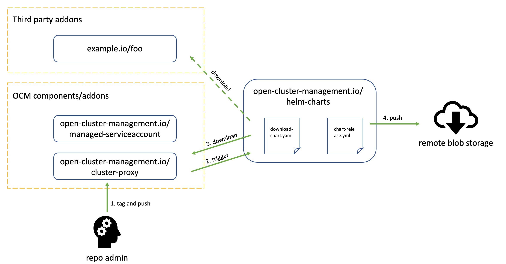

# Helm Charts

[](http://www.apache.org/licenses/LICENSE-2.0.html)
[](https://github.com/open-cluster-management-io/helm-charts/actions/workflows/download-chart.yml)
[](https://github.com/open-cluster-management-io/helm-charts/actions/workflows/chart-release.yml)


This repo is for storing and publishing helm chart packages. Also, the
configured workflow will make the uploaded chart packages are synced
and indexed to the OCM chart repo.

## Install

```shell
$ helm repo add ocm https://openclustermanagement.blob.core.windows.net/releases/
$ helm repo update
$ helm search repo ocm
```

## Upload

Any file edition under `charts/` folder will trigger the workflow [chart-release.yml](./.github/workflows/chart-release.yml)
to flush all the chart packages to the remote repo along with an `index.yaml`
file which is dynamically computed from all the existing chart packages. There
are several approaches to submit a new chart package to this repo:

### 1. Manual upload via pull request

After forking this repo, you can either push the chart package to your own
forked repo via github web pages or git command-lines, and then open a pull
request across the fork.

### 2. Automatic upload via github action

The manual workflow [download-chart.yml](.github/workflows/download-chart.yml)
can be invoked from your own repo via the following action step:

```
- name: submit charts to OCM chart repo
  uses: actions/github-script@v6
  with:
    github-token: ${{ secrets.OCM_BOT_PAT }}
    script: |
      try {
        const result = await github.rest.actions.createWorkflowDispatch({
          owner: 'open-cluster-management-io',
          repo: 'helm-charts',
          workflow_id: 'download-chart.yml',
          ref: 'main',
          inputs: {
            # repo is the target repo to download chart package
            repo: "${{ github.repository }}",
            # version is the target release version to download (without "v" prefix)
            version: "${{ env.TRIMED_RELEASE_VERSION }}",
            # chart-name is the name of the chart package, e.g. a chart-name "foo"
            # and version "1.1.1" will trigger the download action to download a
            # file named "foo-1.1.1.tgz" from the corresponding github release.
            "chart-name": "${{ env.CHART_NAME }}",
          },
        })
        console.log(result);
      } catch(error) {
        console.error(error);
        core.setFailed(error);
      }
```

Note that please also verify that the source code repo is publishing the chart
package tarballs in the release assets. It's recommended to the use the
following action to published charts:

```
- name: publish release
  uses: softprops/action-gh-release@v0.1.5
  env:
    GITHUB_TOKEN: ${{ secrets.GITHUB_TOKEN }}
  with:
    files: |
      # Note: RELEASE_VERSION should not have "v" prefix.
      ${{ env.CHART_NAME }}-${{ env.RELEASE_VERSION }}.tgz
```

## Workflow



### Steps description

1. Code repo admin adds a new release tag and push, which triggers the release
   job flow including release docker image build and chart packaging.
2. At the end of the release job, the code repo should invoke the chart repo's
   "download-chart.yml" workflow to send a notification that a new release is
   out. Note that the released chart packaged should be listed in the github
   release asset files following the name convention of helm charts i.e.
   "<chart name>-<release version>.tgz"
3. The chart repo downloads the chart package from code repo release assets and
   then commits to the "main" branch.
4. A post-commit job in the chart repo named "chart-release.yml" uploads the
   latest artifacts to the remote blob storage along with an index file.
